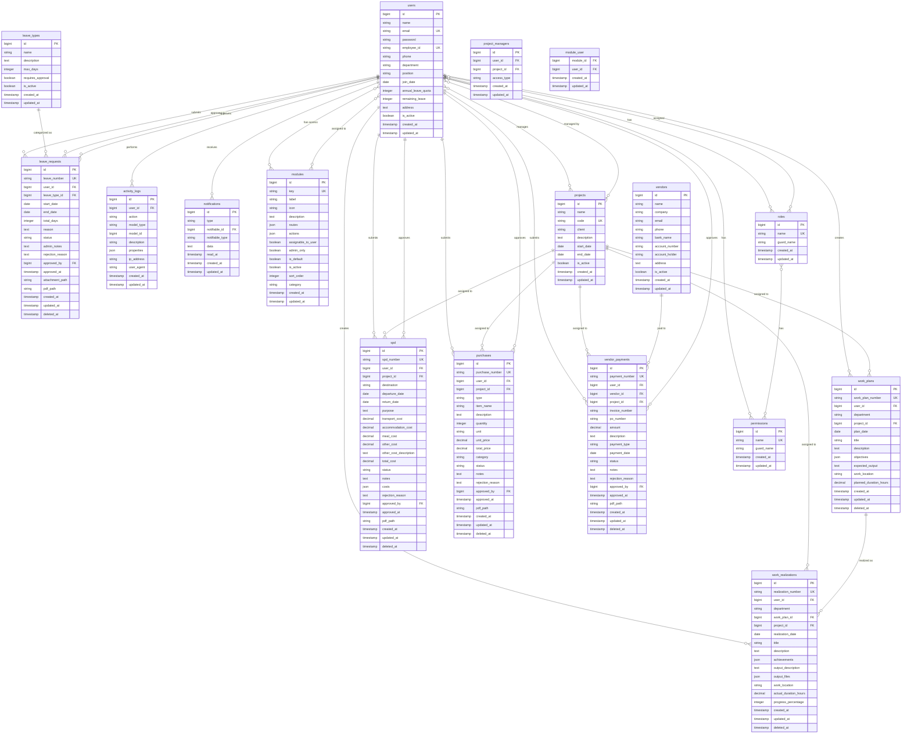
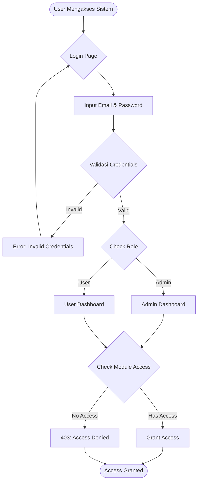
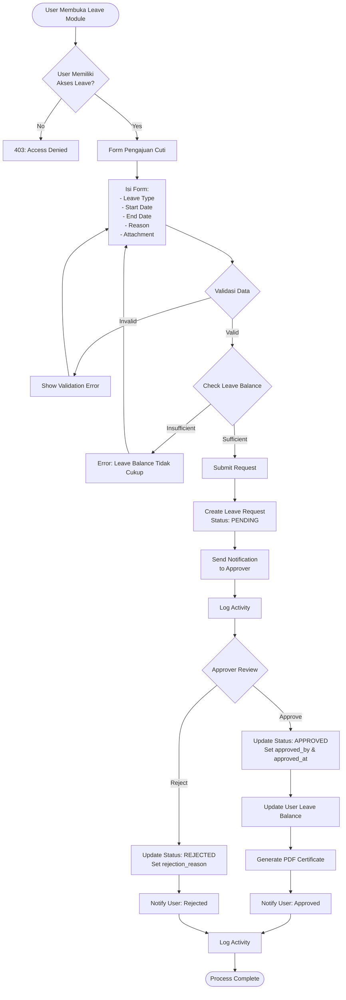
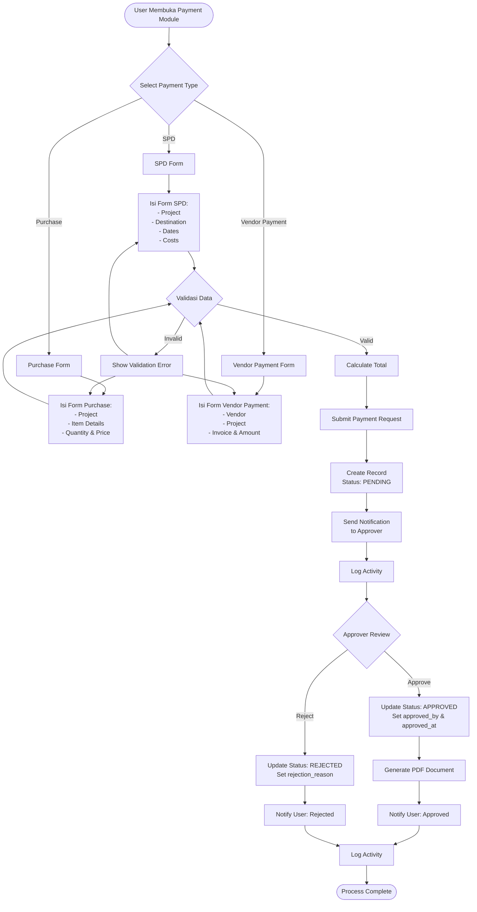
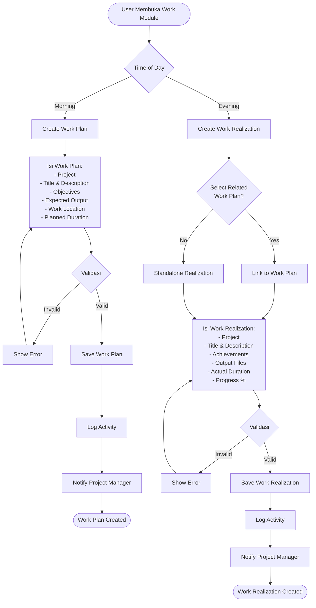
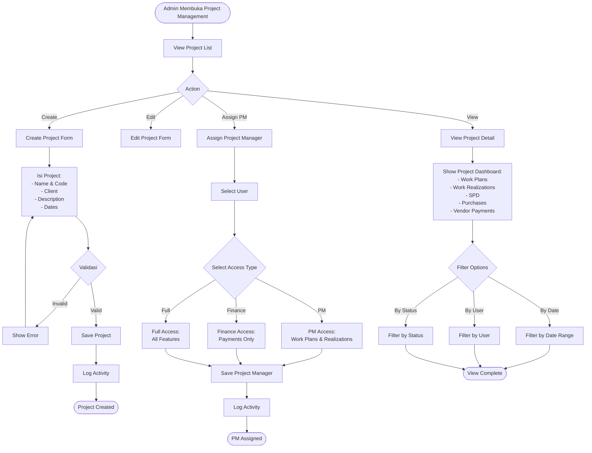
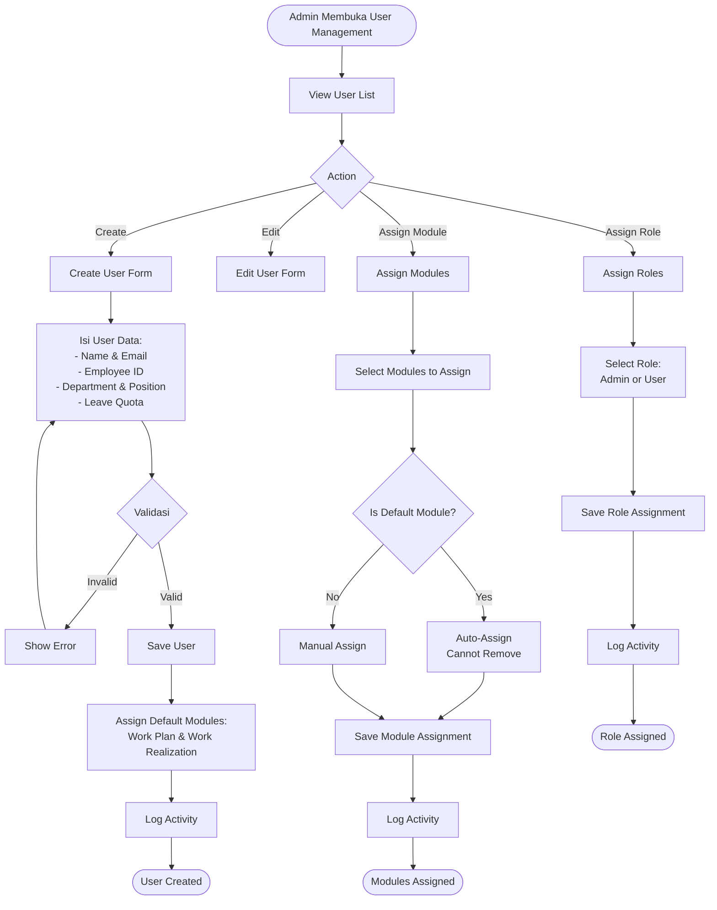
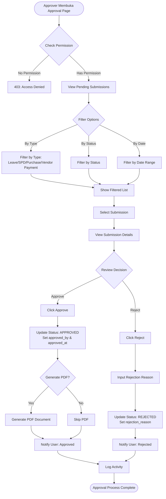

# 📊 ERD & Flowchart Documentation - PGE System

Dokumentasi lengkap Entity Relationship Diagram (ERD) dan Flowchart untuk PGE System.

---

## 📋 Daftar Isi

1. [Entity Relationship Diagram (ERD)](#entity-relationship-diagram-erd)
2. [Flowchart Workflow](#flowchart-workflow)
3. [Penjelasan Relasi Database](#penjelasan-relasi-database)
4. [Penjelasan Workflow](#penjelasan-workflow)

---

## 🗄️ Entity Relationship Diagram (ERD)

### ERD Diagram Lengkap

---

## 🔄 Flowchart Workflow

### 1. Authentication & Authorization Flow

### 2. Leave Request Workflow

### 3. Payment Submission Workflow (SPD/Purchase/Vendor Payment)

### 4. Work Management Workflow

### 5. Project Management Workflow

### 6. User Management Workflow (Admin Only)

### 7. Approval Workflow (Centralized)

---

## 🔗 Penjelasan Relasi Database

### 1. User Relationships

#### One-to-Many Relationships
- **users → work_plans**: Satu user dapat membuat banyak work plan
- **users → work_realizations**: Satu user dapat membuat banyak work realization
- **users → leave_requests**: Satu user dapat mengajukan banyak cuti
- **users → spd**: Satu user dapat membuat banyak SPD
- **users → purchases**: Satu user dapat membuat banyak purchase request
- **users → vendor_payments**: Satu user dapat membuat banyak vendor payment
- **users → activity_logs**: Satu user dapat melakukan banyak aktivitas

#### Many-to-Many Relationships
- **users ↔ modules**: User dapat memiliki banyak modul, modul dapat di-assign ke banyak user
- **users ↔ projects**: User dapat menjadi Project Manager untuk banyak project, project dapat memiliki banyak PM
- **users ↔ roles**: User dapat memiliki banyak role (Spatie Permission)
- **users ↔ permissions**: User dapat memiliki banyak permission (Spatie Permission)

#### Self-Referencing Relationships
- **users → leave_requests (approved_by)**: User dapat menyetujui banyak leave request
- **users → spd (approved_by)**: User dapat menyetujui banyak SPD
- **users → purchases (approved_by)**: User dapat menyetujui banyak purchase
- **users → vendor_payments (approved_by)**: User dapat menyetujui banyak vendor payment

### 2. Project Relationships

#### One-to-Many Relationships
- **projects → work_plans**: Satu project dapat memiliki banyak work plan
- **projects → work_realizations**: Satu project dapat memiliki banyak work realization
- **projects → spd**: Satu project dapat memiliki banyak SPD
- **projects → purchases**: Satu project dapat memiliki banyak purchase
- **projects → vendor_payments**: Satu project dapat memiliki banyak vendor payment

#### Many-to-Many Relationships
- **projects ↔ users (via project_managers)**: Project dapat memiliki banyak PM, user dapat manage banyak project

### 3. Work Management Relationships

#### One-to-Many Relationships
- **work_plans → work_realizations**: Satu work plan dapat memiliki banyak work realization (realisasi)

### 4. Leave Management Relationships

#### One-to-Many Relationships
- **leave_types → leave_requests**: Satu tipe cuti dapat memiliki banyak request

### 5. Payment Management Relationships

#### One-to-Many Relationships
- **vendors → vendor_payments**: Satu vendor dapat menerima banyak payment

### 6. Activity Log Relationships

#### Polymorphic Relationships
- **activity_logs → models**: Activity log dapat merekam aktivitas berbagai model (polymorphic)

---

## 📝 Penjelasan Workflow

### 1. Authentication & Authorization

**Proses:**
1. User mengakses sistem melalui halaman login
2. Input email dan password
3. Sistem validasi credentials
4. Jika valid, check role user (Admin/User)
5. Redirect ke dashboard sesuai role
6. Setiap akses modul dicek permission dan module access

**Kontrol Akses:**
- **Role-based**: Admin memiliki akses penuh, User memiliki akses terbatas
- **Module-based**: User hanya dapat mengakses modul yang di-assign
- **Permission-based**: Setiap aksi dicek permission menggunakan Spatie Permission

### 2. Leave Request Workflow

**Proses:**
1. User mengisi form pengajuan cuti
2. Validasi data (tanggal, balance, dll)
3. Check leave balance user
4. Create leave request dengan status PENDING
5. Kirim notifikasi ke approver
6. Approver review dan approve/reject
7. Jika approved: update balance, generate PDF
8. Kirim notifikasi ke user
9. Log semua aktivitas

**Status:**
- **PENDING**: Menunggu persetujuan
- **APPROVED**: Disetujui
- **REJECTED**: Ditolak

### 3. Payment Submission Workflow

**Proses:**
1. User memilih jenis payment (SPD/Purchase/Vendor Payment)
2. Mengisi form sesuai jenis payment
3. Validasi data dan perhitungan total
4. Submit dengan status PENDING
5. Kirim notifikasi ke approver
6. Approver review dan approve/reject
7. Jika approved: generate PDF document
8. Kirim notifikasi ke user
9. Log semua aktivitas

**Jenis Payment:**
- **SPD**: Surat Perjalanan Dinas dengan detail biaya
- **Purchase**: Purchase request dengan item detail
- **Vendor Payment**: Pembayaran ke vendor dengan invoice tracking

### 4. Work Management Workflow

**Work Plan:**
1. User membuat work plan di pagi hari
2. Assign ke project tertentu
3. Isi detail rencana kerja
4. Save dan notify Project Manager

**Work Realization:**
1. User membuat work realization di sore hari
2. Dapat link ke work plan terkait (optional)
3. Isi detail realisasi kerja
4. Upload output files jika ada
5. Save dan notify Project Manager

### 5. Project Management Workflow

**Project Creation:**
1. Admin membuat project baru
2. Isi detail project (name, code, client, dates)
3. Set project sebagai active/inactive

**Project Manager Assignment:**
1. Admin assign user sebagai Project Manager
2. Pilih access type:
   - **PM**: Akses Work Plans & Realizations
   - **Finance**: Akses Payments only
   - **Full**: Akses semua fitur
3. Project Manager dapat monitor project di dashboard

### 6. User Management Workflow

**User Creation:**
1. Admin membuat user baru
2. Isi data user lengkap
3. Assign default modules (Work Plan & Work Realization)
4. Assign role (Admin/User)

**Module Assignment:**
1. Admin assign modules ke user
2. Default modules selalu aktif (tidak bisa dihapus)
3. Optional modules dapat di-assign sesuai kebutuhan

**Role Assignment:**
1. Admin assign role ke user
2. Role menentukan akses dasar user
3. Permission granular diatur melalui Spatie Permission

### 7. Approval Workflow

**Proses Approval:**
1. Approver membuka halaman approval
2. Filter submissions berdasarkan type, status, date
3. Review detail submission
4. Approve atau Reject dengan reason
5. Update status di database
6. Generate PDF jika approved
7. Kirim notifikasi ke user
8. Log aktivitas

**Approval Types:**
- **Leave Approval**: Persetujuan cuti
- **Payment Approval**: Persetujuan SPD, Purchase, Vendor Payment

---

## 📊 Indexes & Performance

### Indexes yang Diterapkan

1. **users**
   - `email` (unique)
   - `employee_id` (unique)

2. **work_plans**
   - `work_plan_number` (unique)
   - `user_id, plan_date` (composite)
   - `project_id`

3. **work_realizations**
   - `realization_number` (unique)
   - `user_id, realization_date` (composite)
   - `work_plan_id`
   - `project_id`

4. **leave_requests**
   - `leave_number` (unique)
   - `user_id, status` (composite)
   - `status`

5. **spd**
   - `spd_number` (unique)
   - `user_id, status` (composite)
   - `status`

6. **purchases**
   - `purchase_number` (unique)
   - `user_id, status` (composite)
   - `status`

7. **vendor_payments**
   - `payment_number` (unique)
   - `user_id, status` (composite)
   - `payment_date`

8. **project_managers**
   - `user_id, project_id` (unique composite)
   - `user_id`
   - `project_id`

9. **activity_logs**
   - `user_id, created_at` (composite)
   - `model_type, model_id` (composite)
   - `action`
   - `created_at`

---

## 🔐 Constraints & Rules

### Foreign Key Constraints

1. **Cascade Delete:**
   - `users` → `work_plans`, `work_realizations`, `leave_requests`, `spd`, `purchases`, `vendor_payments`
   - `vendors` → `vendor_payments`
   - `leave_types` → `leave_requests`

2. **Set Null on Delete:**
   - `projects` → `work_plans`, `work_realizations`, `spd`, `purchases`, `vendor_payments`
   - `users` → `leave_requests.approved_by`, `spd.approved_by`, `purchases.approved_by`, `vendor_payments.approved_by`
   - `work_plans` → `work_realizations.work_plan_id`

3. **Unique Constraints:**
   - `users.email`
   - `users.employee_id`
   - `projects.code`
   - `work_plans.work_plan_number`
   - `work_realizations.realization_number`
   - `leave_requests.leave_number`
   - `spd.spd_number`
   - `purchases.purchase_number`
   - `vendor_payments.payment_number`
   - `project_managers(user_id, project_id)`

### Business Rules

1. **Leave Balance:**
   - User tidak dapat mengajukan cuti melebihi `remaining_leave`
   - Setelah approved, `remaining_leave` dikurangi `total_days`

2. **Project Manager:**
   - Satu user dapat menjadi PM untuk banyak project
   - Satu project dapat memiliki banyak PM dengan access type berbeda

3. **Work Realization:**
   - Dapat link ke work plan (optional)
   - Dapat standalone (tidak link ke work plan)

4. **Approval:**
   - Hanya user dengan permission dapat approve
   - Admin dapat approve semua jenis submission
   - User dapat approve jika memiliki module approval access

5. **Soft Deletes:**
   - Semua submission menggunakan soft delete
   - Data tidak benar-benar dihapus dari database

---

## 📌 Catatan Penting

1. **Modular Architecture**: Sistem menggunakan arsitektur modular dengan enable/disable per user
2. **RBAC**: Menggunakan Spatie Permission untuk role dan permission management
3. **Audit Trail**: Semua aktivitas dicatat di `activity_logs`
4. **Notifications**: Real-time notifications untuk semua event penting
5. **PDF Generation**: Auto-generate PDF untuk dokumen resmi setelah approval
6. **Soft Deletes**: Semua submission menggunakan soft delete untuk data recovery

---

**Dokumen ini dibuat untuk PGE System v1.10.0**
**Last Updated**: 2025

